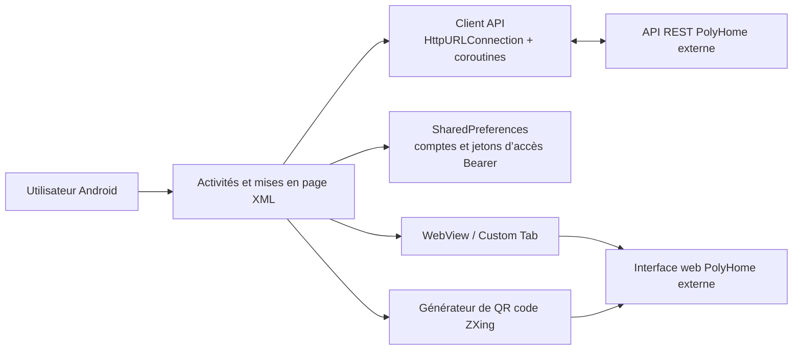

# PolyHome

PolyHome est un client Android natif permettant de consulter et de piloter un environnement domotique PolyHome. Il se connecte à une API REST et à une interface web hébergées à l'extérieur ; le service côté serveur ne fait pas partie de ce dépôt.

Ce dépôt contient un prototype académique. Ses principaux parcours utilisateur sont implémentés dans le code source, mais son fonctionnement de bout en bout dépend toujours d'un service PolyHome accessible et d'un compte valide.

## Présentation du projet

L'application offre à un utilisateur authentifié une vue mobile des maisons associées à son compte. Depuis un écran unique, il peut consulter l'état des équipements, envoyer des commandes individuelles ou groupées, gérer les accès partagés lorsqu'il est propriétaire d'une maison et ouvrir l'interface distante de la maison dans une WebView ou un onglet du navigateur.

## Fonctionnalités principales

| Fonctionnalité | État de l'implémentation |
| --- | --- |
| Inscription et authentification par mot de passe | Implémentées ; nécessitent l'API distante |
| Enregistrement de plusieurs comptes et changement de session local | Implémentés avec les `SharedPreferences` Android |
| Découverte des maisons, affichage du statut de propriétaire et changement de maison | Implémentés ; nécessitent l'API distante |
| Liste des équipements avec filtres par type et par état | Implémentée avec une actualisation toutes les cinq secondes |
| Commandes individuelles des équipements | Implémentées avec des mécanismes de compatibilité pour plusieurs variantes de routes API |
| Commandes groupées par sélection, type d'équipement ou étage | Implémentées ; la détection de l'étage repose sur des heuristiques |
| Liste, attribution et retrait des accès à une maison | Implémentés dans le client ; les actions réservées au propriétaire dépendent de l'autorisation du service côté serveur |
| Vue distante de la maison et mécanisme de repli pour l'initialisation du navigateur | Implémentés avec WebView et Android Custom Tabs |
| QR code partageable de la maison | Implémenté avec ZXing |

Le terme « implémenté » décrit le code client présent dans ce dépôt. Les parcours utilisant l'API réelle ne sont pas couverts par des tests d'intégration automatisés.

## Architecture



L'application comporte un seul module Android. `MainActivity`, `LoginActivity` et `RegisterActivity` gèrent l'entrée dans l'application et l'authentification. `DevicesActivity` regroupe la sélection des maisons, le contrôle des équipements, la gestion des accès, la génération du QR code et la vue web intégrée. `Api` exécute les requêtes HTTP JSON dans une coroutine d'entrée/sortie, tandis que `TokenStore` conserve les sessions locales.

### Structure du dépôt

```text
PolyHome/
├── app/
│   ├── build.gradle.kts
│   └── src/
│       ├── main/
│       │   ├── java/com/example/projet_androide/
│       │   │   ├── data/          # Routes API, modèles et stockage des sessions
│       │   │   └── *Activity.kt   # Écrans Android et interactions
│       │   ├── res/                # Mises en page, ressources graphiques, menus et thèmes
│       │   └── AndroidManifest.xml
│       ├── test/                    # Tests JVM locaux
│       └── androidTest/             # Test instrumenté élémentaire sur appareil
├── gradle/                          # Catalogue de versions et wrapper Gradle
├── .env.example                    # Surcharge facultative de l'URL de base de l'API
└── settings.gradle.kts
```

## Socle technique

| Domaine | Technologie |
| --- | --- |
| Langage | Kotlin 2.2.0 |
| Plateforme | Android SDK 25–36 |
| Interface | Mises en page XML Android, AndroidX AppCompat, Material Components, ConstraintLayout |
| Réseau | `HttpURLConnection`, coroutines Kotlin, API REST JSON |
| Sérialisation | Gson 2.11.0 |
| Intégration au navigateur | AndroidX Browser, WebView, Custom Tabs |
| Génération de QR code | ZXing Core 3.5.3 |
| Compilation | Gradle 8.13, Android Gradle Plugin 8.13.1, cible JVM 11 |
| Tests | JUnit 4, AndroidX Test, Espresso |

## Installation

### Prérequis

- Git.
- Android Studio avec Android SDK 36 installé, ou un environnement Android équivalent en ligne de commande.
- JDK 17 ou 21. Le JDK 21 a été validé pour ce projet ; le JDK 25 n'est pas compatible avec la configuration Gradle actuelle.
- Un appareil Android ou un émulateur utilisant le niveau d'API 25 ou une version ultérieure.
- Un accès réseau et un compte PolyHome valide pour les fonctionnalités qui dépendent du service côté serveur.

### Cloner et compiler

```bash
git clone https://github.com/lele9627/PolyHome.git
cd PolyHome
./gradlew assembleDebug
```

Dans Android Studio, ouvrez la racine du dépôt, attendez la synchronisation Gradle, sélectionnez la configuration d'exécution `app`, puis démarrez un émulateur ou utilisez un appareil connecté.

Pour une compilation en ligne de commande, indiquez l'emplacement du SDK avec `ANDROID_HOME` ou dans un fichier `local.properties` ignoré par Git :

```properties
sdk.dir=/absolute/path/to/Android/sdk
```

Installez la version de debug sur un appareil ou un émulateur en cours d'exécution avec :

```bash
./gradlew installDebug
```

Sous Windows, utilisez `gradlew.bat` à la place de `./gradlew`.

## Configuration

`POLYHOME_API_BASE_URL` est le seul paramètre pris en charge au moment de la compilation. Malgré son nom, sa valeur doit correspondre à l'origine HTTPS de confiance qui fournit à la fois les routes `/api/...` et la vue du navigateur à l'adresse `?houseId=...` ; un point de terminaison exclusivement réservé à l'API interrompra le parcours WebView. Si la variable est absente, la compilation utilise l'origine publique PolyHome déjà configurée dans l'application d'origine.

La valeur peut être fournie sous forme de variable d'environnement :

```bash
export POLYHOME_API_BASE_URL="https://polyhome.example.org"
./gradlew assembleDebug
```

Elle peut également être transmise comme propriété de projet Gradle :

```bash
./gradlew -PPOLYHOME_API_BASE_URL="https://polyhome.example.org" assembleDebug
```

`.env.example` documente cette variable. Gradle ne charge pas `.env` automatiquement ; si vous préférez ce fonctionnement, chargez une copie locale dans l’interpréteur de commandes avant d'exécuter Gradle. Conservez les fichiers `.env`, les identifiants, les jetons d’accès Bearer et les clés de signature hors du contrôle de version.

Les jetons d'authentification sont renvoyés par l'API pendant l'exécution et stockés dans les préférences privées de l'application. Les règles de sauvegarde excluent ces préférences des sauvegardes cloud et des transferts entre appareils, mais les valeurs ne sont pas chiffrées au repos.

## Utilisation

1. Lancez l'application et choisissez l'inscription ou la connexion.
2. Créez un compte de test ou authentifiez-vous avec un compte PolyHome existant.
3. Sélectionnez l'une des maisons renvoyées pour l'utilisateur authentifié.
4. Consultez le résumé de la maison et développez le panneau des composants pour filtrer ou piloter les équipements.
5. Sélectionnez des équipements pour exécuter des commandes par lot, ou utilisez les commandes groupées des lumières, volets et garages.
6. Si le compte actif est propriétaire de la maison, utilisez le panneau des accès pour afficher, ajouter ou retirer des utilisateurs autorisés.
7. Appuyez sur le QR code ou utilisez la vue web intégrée pour ouvrir l'interface distante de la maison.
8. Utilisez l'action de la barre d'outils pour fermer la session active.

N'utilisez pas d'identifiants de production ou sensibles dans les versions de développement.

## Tests

Exécutez les tests JVM locaux :

```bash
./gradlew testDebugUnitTest
```

La suite de tests unitaires actuelle couvre la construction des routes API et la représentation de l'état des modèles d'équipement. Elle n'appelle pas le service distant.

Exécutez le test instrumenté élémentaire sur un émulateur ou un appareil connecté :

```bash
./gradlew connectedDebugAndroidTest
```

Vérifications locales supplémentaires :

```bash
./gradlew lintDebug
./gradlew assembleDebug
```

## Captures d'écran

Les captures d'écran ne sont pas encore incluses. Remplacez ces emplacements par des images provenant d'un compte de test ne contenant aucune donnée sensible.

| Authentification | Tableau de bord de la maison | Contrôle des équipements |
| :---: | :---: | :---: |
| _Emplacement réservé : `docs/screenshots/authentication.png`_ | _Emplacement réservé : `docs/screenshots/house-dashboard.png`_ | _Emplacement réservé : `docs/screenshots/device-controls.png`_ |

## État du projet

**État : prototype académique fonctionnel, non prêt pour la production.**

Le client Android se compile, ses tests unitaires locaux couvrent le comportement déterministe des routes et des modèles, et les principaux parcours de l'interface et de l'API sont implémentés. Cette passe documentaire n'a pas validé l'inscription, l'authentification, les commandes d'équipements ou la gestion des accès avec le service réel, car ces vérifications nécessitent des identifiants externes et un service côté serveur disponible.

Ce dépôt ne contient actuellement aucune version publiée, aucun flux de travail d'intégration continue, aucune suite de tests de bout en bout et aucune documentation de déploiement du service côté serveur.

## Limitations connues

- Le service côté serveur et l'interface web sont des dépendances externes qui ne peuvent pas être reproduites à partir de ce seul dépôt.
- Le comportement de l'API réelle et la compatibilité des réponses ne sont pas couverts par des tests d'intégration automatisés.
- Les commandes d'équipements essaient plusieurs variantes de routes et de méthodes pour assurer leur compatibilité ; le contrat canonique du service côté serveur devrait être unifié.
- Le regroupement par étage déduit l'étage à partir du nom et de l'identifiant des équipements ; des noms inhabituels peuvent donc être mal classés.
- Les jetons d’accès Bearer enregistrés utilisent des `SharedPreferences` non chiffrées ; leur exclusion des sauvegardes réduit l'exposition, mais ne fournit aucun chiffrement au repos.
- Les appels réseau ne proposent actuellement aucun délai d’attente configurable, aucune nouvelle tentative ni aucun détail d'erreur structuré dans l'interface.
- La compilation ne vérifie pas qu'une surcharge de `POLYHOME_API_BASE_URL` est une origine HTTPS non vide ; contrôlez la valeur avant de distribuer un APK.
- La majorité des textes visibles par l'utilisateur sont codés en dur en français au lieu d'être stockés dans des ressources de chaînes localisées.
- L’espace de noms de l'application conserve l'identifiant de prototype `com.example.projet_androide`.
- La couverture automatisée se limite aux tests locaux des routes et des modèles ainsi qu'à un contrôle instrumenté élémentaire du contexte de l'application.

## Contributeurs

Contributeurs enregistrés dans l'historique Git :

- [lele9627](https://github.com/lele9627)
- [Victor3699](https://github.com/Victor3699)

## Licence

Aucun fichier de licence n'est actuellement inclus. L'historique Git contient des contributions substantielles des deux contributeurs documentés, et aucun élément du dépôt n'établit leur accord sur les conditions d'une licence. La réutilisation n'est donc pas autorisée par défaut. Ajoutez une licence uniquement après confirmation de la propriété du code et accord des contributeurs sur ses conditions.
